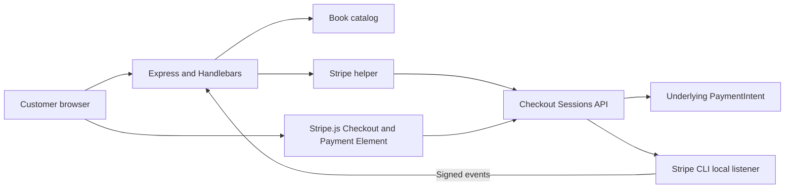
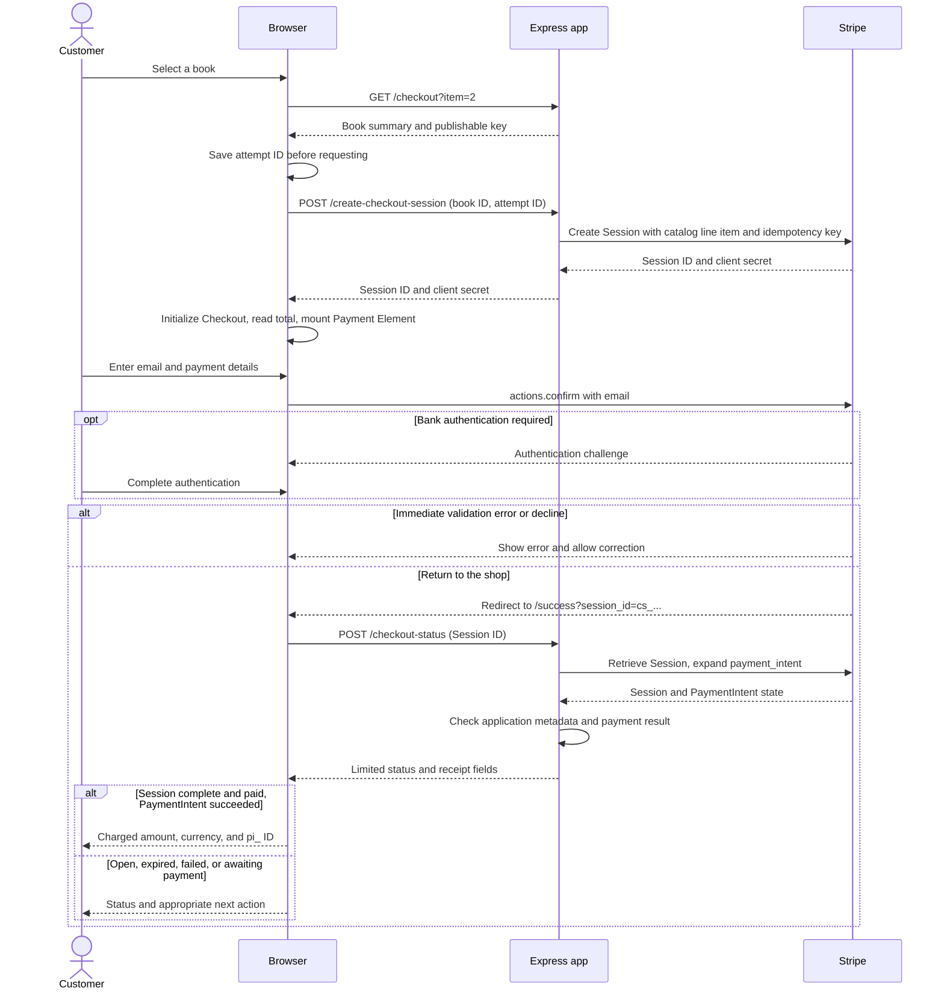
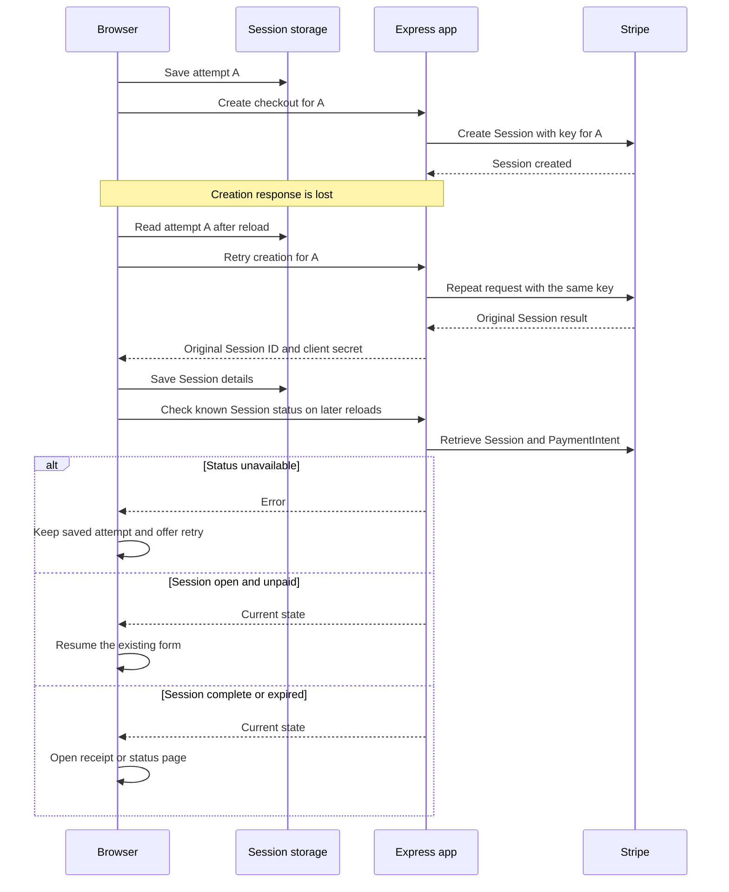
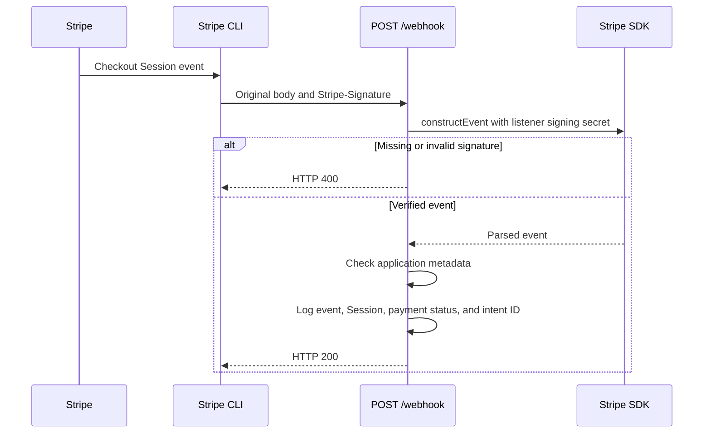

# Design

[Overview](../README.md) · [Setup](setup.md) · [Components](#components) · [Purchase](#purchase-and-confirmation) · [Recovery](#retry-and-recovery) · [Webhooks](#webhook-delivery)

## Components

One Express process serves pages and payment endpoints. Checkout Sessions manage line items and payment state; the Payment Element stays on the shop's own page. The [code map](../README.md#architecture) identifies each file.

- **Server:** owns catalog pricing and holds the secret API key.
- **Browser:** receives the Session client secret and ID; session storage keeps the checkout attempt.
- **Stripe:** collects payment details and holds Session and payment records. The app does not store card data.

## Purchase and confirmation

The Session client secret initializes Checkout; it is not passed to `stripe.confirmPayment`. Confirmation uses Checkout's actions. The page reads the current Session total through `actions.getSession()` and updates it on Checkout's `change` event.

### Application endpoints

| Endpoint | Behavior |
| --- | --- |
| `GET /` | Render the book catalog |
| `GET /checkout?item=:id` | Validate the selection and render checkout |
| `POST /create-checkout-session` | Accept `{ itemId, attemptId }`; use catalog pricing; return `{ sessionId, clientSecret }` |
| `POST /checkout-status` | Accept `{ sessionId }`; retrieve the Session and PaymentIntent; return status, received amount, currency, payment ID, book ID, and attempt ID |
| `GET /success` | Render the receipt shell; the browser requests Session status |
| `POST /webhook` | Verify the signature and log relevant Session events |

- **Receipt access:** the opaque Session ID acts as a bearer reference, checked against the application's metadata. Keep receipt links private. This demo has no customer login; it returns no email, address, or client secret from the status endpoint.
- **Errors:** 400 for malformed references, 404 for missing/unrelated records, and 502 when status cannot be verified. A paid Session without a verified successful PaymentIntent also waits for a retry.
- **Headers:** payment pages use `no-store`, `no-referrer`, and a Content Security Policy. Payment API responses use `no-store`.

## Retry and recovery

Creation retries reuse the original key while the attempt is under 24 hours old. Older attempts without a Session ID stop for reconciliation. Known Sessions are retrieved regardless of age; Stripe's confirmed expiry allows a new checkout.

| Verified state | Customer experience | Stored attempt |
| --- | --- | --- |
| Complete, paid, successful PaymentIntent | Receipt with amount and `pi_` ID | Clear matching Session and attempt |
| Expired | Select the book again | Clear matching Session and attempt |
| Complete, unpaid, payment failed | Start a new checkout | Clear matching Session and attempt |
| Complete, payment still pending | Check again | Preserve |
| Open and unpaid | Return to checkout | Reuse |
| Retrieval error | Retry the status check | Preserve |

Pay waits for the Element to be ready and is disabled during confirmation. Initialization retries destroy the previous Element; callbacks from older instances cannot enable the new form.

Records from the previous direct-PaymentIntent integration are preserved and flagged for review, not silently replaced. Clearing storage or switching devices loses the association; persistent orders are needed for recovery across devices.

## Webhook delivery

The raw-body route runs before the JSON parser. The handler observes:

- `checkout.session.completed`: checkout completed; payment may still be unpaid
- `checkout.session.async_payment_succeeded`: a delayed payment succeeded
- `checkout.session.async_payment_failed`: a delayed payment failed
- `checkout.session.expired`: an unpaid checkout expired

Other verified events are acknowledged. Repeated events may produce repeated logs; there are no fulfillment side effects. When fulfillment is added, both completion and delayed-success events must check payment status and update a persistent order idempotently.

Delivery is independent of the receipt visit. The [launcher](setup.md#launcher) supplies the local listener's signing secret. In production, Stripe would send events directly to a registered HTTPS endpoint with its own secret.
