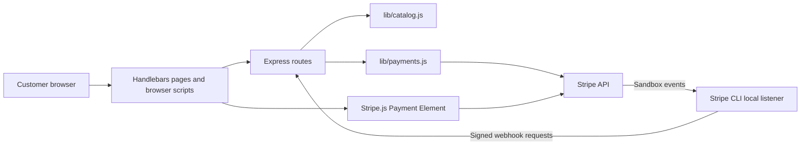
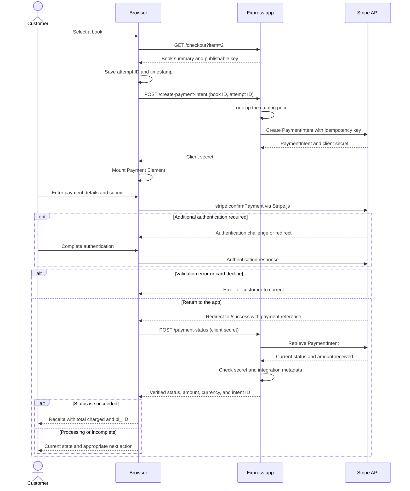
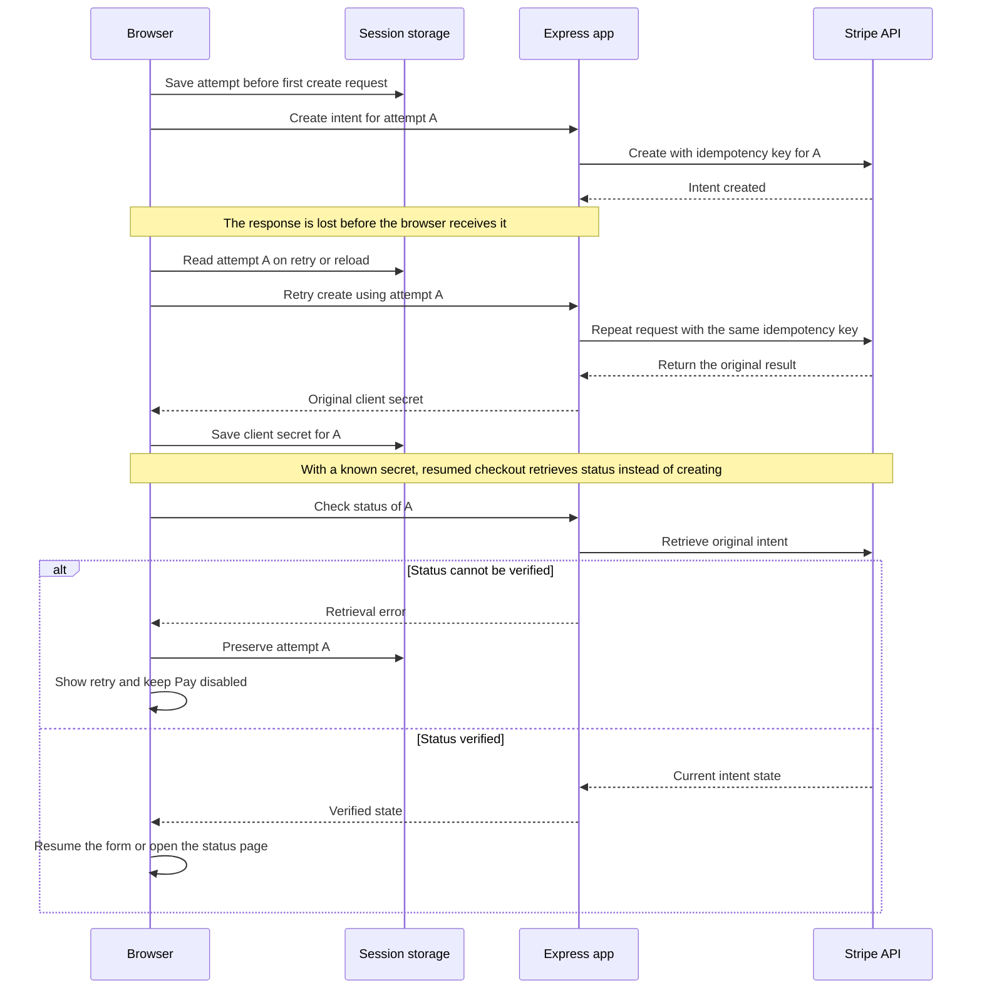
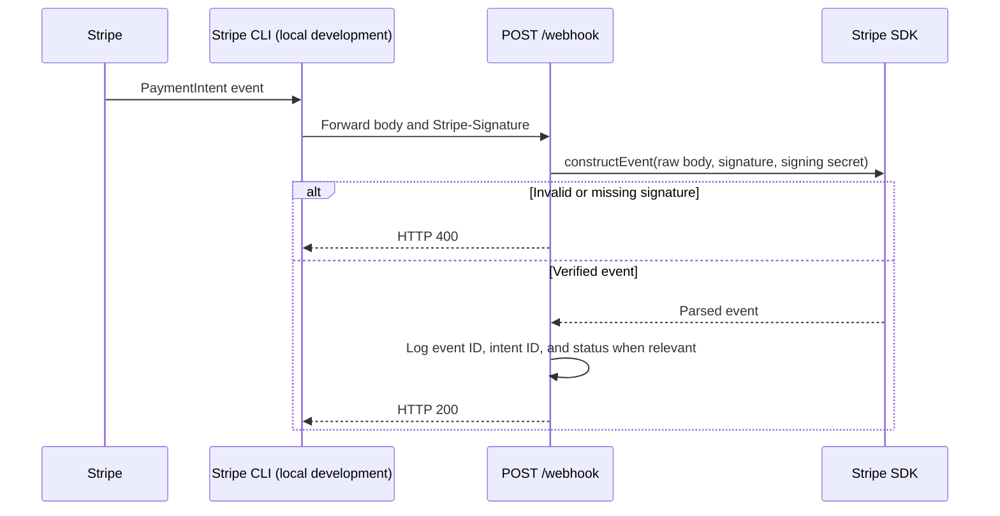

# Design

[Overview](../README.md) · [Setup](setup.md) · [Components](#components) · [Purchase](#purchase-and-confirmation) · [Recovery](#retry-and-recovery) · [Webhooks](#webhook-delivery)

## Components

One Express process serves pages and payment endpoints. Stripe operations are isolated in a helper module; the [code map](../README.md#architecture) identifies each file.

- **Server:** owns pricing and holds the secret API key.
- **Browser:** receives the publishable key and payment client secret; session storage retains the attempt for recovery.
- **Stripe:** collects payment details and holds payment records. The app does not store card data.

## Purchase and confirmation

The receipt checks the client secret and `integration` metadata against a freshly retrieved intent. A redirect alone cannot confirm payment.

### Application endpoints

| Endpoint | Behavior |
| --- | --- |
| `GET /` | Render the book catalog |
| `GET /checkout?item=:id` | Validate the selection and render checkout |
| `POST /create-payment-intent` | Accept `{ itemId, attemptId }`; use catalog pricing; return `{ clientSecret }` |
| `POST /payment-status` | Accept `{ clientSecret }`; return verified status, received amount, currency, intent ID, book ID, and attempt ID |
| `GET /success` | Render the receipt shell; the browser requests payment status |
| `POST /webhook` | Verify the signature and log relevant events |

- Status errors: **400** for malformed references, **404** for missing/mismatched records, **502** for temporary retrieval failures.
- Payment pages use `no-store`, `no-referrer`, and a Content Security Policy. Payment API responses use `no-store`.
- Client secrets grant access to a payment; do not log or share them. This is not customer account authentication.

## Retry and recovery

Creation retries reuse the attempt's idempotency key while it is under 24 hours old. Older attempts without a saved client secret stop for reconciliation; known intents remain retrievable. Clearing storage or switching devices loses the association.

| Verified state | Customer action | Stored attempt |
| --- | --- | --- |
| `succeeded` | View receipt | Clear matching attempt |
| `canceled` | Return to catalog | Clear matching attempt |
| `processing` | Check again | Preserve |
| `requires_payment_method` | Correct details and retry | Reuse |
| `requires_action` / `requires_confirmation` | Return to checkout | Reuse |
| Other state or retrieval error | Follow status message or retry check | Preserve |

Pay stays disabled until the Element is ready and while confirmation is in progress. An old receipt cannot clear a newer attempt.

## Webhook delivery

- The raw-body route runs before Express's JSON parser so signature verification receives the original bytes.
- Relevant events: `payment_intent.succeeded`, `payment_intent.processing`, and `payment_intent.payment_failed`.
- Other verified events receive HTTP 200. Repeated events may produce repeated logs; there are no fulfillment side effects.
- Delivery is independent of the receipt visit and can arrive before or after it.

Locally, the [launcher](setup.md#launcher) supplies the CLI listener's signing secret. In production, Stripe would send events directly to a registered HTTPS endpoint with its own secret.

Persistent orders and fulfillment are [planned extensions](../README.md#next-steps), alongside merchant tools and deployment controls.
