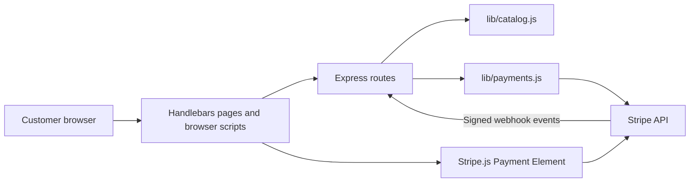
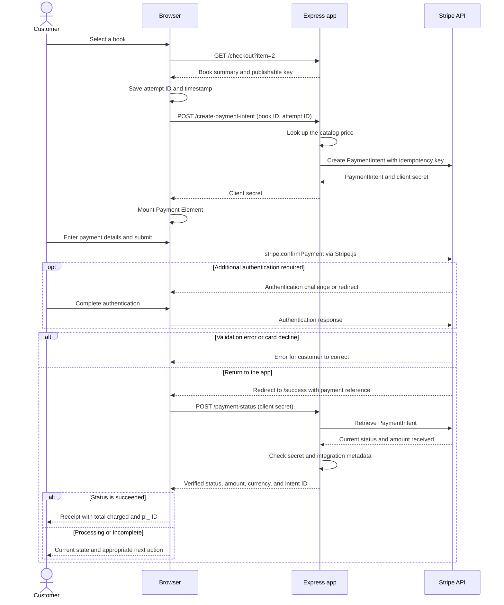
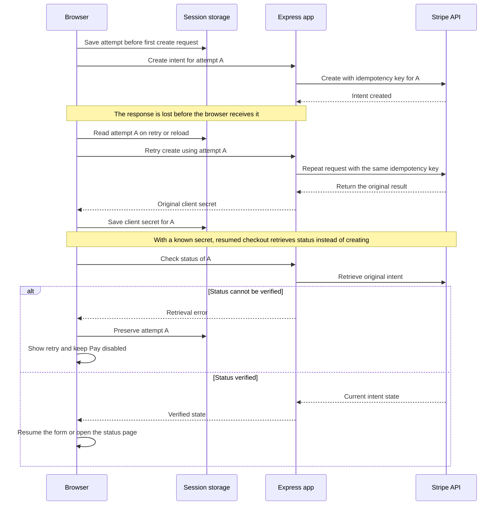
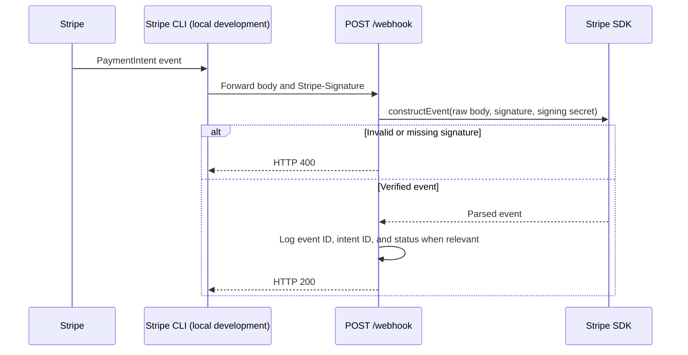

# Design

The application is one Express process serving Handlebars pages, browser scripts, and three payment endpoints. The catalog is a small module; payment operations are isolated in another module. This keeps the demo easy to run and leaves a clear place to add another Stripe feature during an interview.

## Components

| File or directory | Responsibility |
| --- | --- |
| `app.js` | Routes, request validation, rendering, security headers, and raw webhook parsing |
| `lib/catalog.js` | Book IDs, display information, and amounts in minor currency units |
| `lib/payments.js` | Stripe client, PaymentIntent creation/retrieval, and signature verification |
| `views/` | Catalog, checkout, receipt shell, and shared layout |
| `public/js/checkout.js` | Attempt storage, Payment Element lifecycle, and payment confirmation |
| `public/js/success.js` | Verified receipt states and matching-attempt cleanup |
| `test/` | Route, browser-script, and file-path portability checks |

The server trusts its own catalog for pricing. Stripe receives payment details directly from Stripe.js. The application stores only an attempt ID, its creation time, and the client secret in the current tab's session storage; it does not store card data.

## Purchase and confirmation

The return page never treats `redirect_status=succeeded` as proof of payment. It shows a loading state until the server response arrives. The status endpoint requires the full client secret and checks the intent's `integration` metadata before returning the limited receipt fields.

| App endpoint | Input and behavior |
| --- | --- |
| `GET /` | Render the catalog |
| `GET /checkout?item=:id` | Validate the selected book and render its order summary |
| `POST /create-payment-intent` | Accept `{ itemId, attemptId }`; validate the ID and UUID; create using catalog price; return `{ clientSecret }` |
| `POST /payment-status` | Accept `{ clientSecret }`; retrieve and verify the intent; return status, amount received, currency, intent ID, book ID, and attempt ID |
| `GET /success` | Render the receipt shell; the browser then requests verified status |
| `POST /webhook` | Verify the signed raw body and observe payment events |

The status endpoint returns 400 for malformed references, 404 for missing or mismatched records, and 502 for temporary retrieval failures. Checkout and receipt pages send `no-store`, `no-referrer`, and a Content Security Policy permitting the required Stripe resources. API responses containing payment information use `no-store`. Client secrets are sensitive payment references and should not be logged or shared.

## Retry and recovery

The create retry in this diagram is allowed only while the attempt is under 24 hours old. If it is older and has no saved client secret, checkout stops for manual reconciliation. A known intent can still be retrieved after that time. This is a browser recovery strategy, not a persistent order system: clearing storage or using another browser loses the association.

| Verified state | Customer experience | Stored attempt |
| --- | --- | --- |
| `succeeded` | Receipt with the charged amount and ID | Clear only if the attempt ID matches |
| `canceled` | Canceled receipt; return to catalog to buy again | Clear only if the attempt ID matches |
| `processing` | Pending message and Check again | Preserve |
| `requires_payment_method` | Retry payment with corrected details | Preserve and reuse |
| `requires_action` / `requires_confirmation` | Return to checkout to finish | Preserve and reuse |
| Other state | Neutral incomplete-payment message | Preserve |
| Network or status error | Retry without assuming failure or success | Preserve |

An old receipt cannot clear a newer attempt for the same book. Pay is enabled only after the Payment Element is ready, and repeated submit actions are guarded while confirmation is in progress.

## Webhook delivery

Webhook delivery is independent of the receipt-page visit and may arrive before or after it. The raw-body middleware is registered before the general JSON parser. The endpoint observes `payment_intent.succeeded`, `payment_intent.processing`, and `payment_intent.payment_failed`; other verified events are acknowledged without additional work.

Repeated events can produce repeated logs, but there are no fulfillment side effects. A production extension would persist the order and processed event IDs, reconcile the payment state, and trigger fulfillment once. Receipt redirects would remain a customer convenience rather than a dependency for fulfilling an order.
